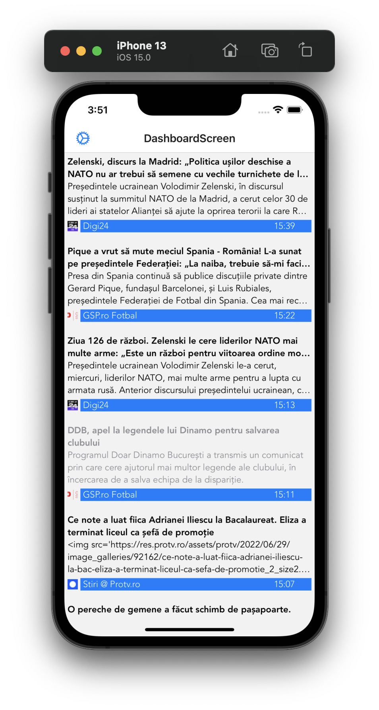

# pureArssenal

## What is it
An RSS reader for iOS built with Typescript and React Native. Proof of concept really.

## History
[The first attempt](https://github.com/aiserban/arssenal) at such a reader was with Expo & ReactNative. I ended up with a lot of effort spent  searching for Expo-compatible libraries, or doing a lot of mumbo-jumbo trying to make things work. For a tool made to simplify things, Expo created more problems than it solved.

I've decided to scrap that project and migrate the existing code to a clean project (this one), built with just Typescript & ReactNative (no Expo).

## So what does it do?
Currently* it fetches articles from some feeds. You can see the list of items retrieved, sorted by date & time.

Tap on any one of them to open the link in a WebView. The item becomes 'read' at the same time and the state persists throughout the session (no real backend right now).

You can search for a new feed by entering a URL. If it's a valid feed, you can add it to the list. Articles will update when going back to include this source as well.

\* Readme might be out of date

## How to run in the iOS Simulator

**Important**: Please note that I'm working on this as an iOS only app. It should be able to run on Android devices as well (one of the main features of ReactNative), but I don't have the means to test and debug.

Like all iOS apps, you NEED to have a **MacOS** device to be able to run it. You also need to have **XCode and Simulator** installed. Nothing related to this project, it's just how Apple handles development for their devices.

- clone repo

- install CocoaPods with `brew install cocoapods` OR `sudo gem install cocoapods`

- `cd pureArssenal`

- `npm install`

- `npm i react-native-eject`

- `npm i @react-native-community/cli`

- `react-native eject`

- `cd ios && pod install && cd ..` (should you have issues here run `pod repo update` and then `pod install` again)

- `react-native run-ios` - Should now build and start the app in the Simulator

I hope I haven't missed anything. Unfortunately, my dev environment is already set up and it's easy to miss a step that I might have done ages ago while working on something else.

### Troubleshooting
Error regarding React Native Vector Icons?

- Edit the Podfile in the ios dir and add `pod 'RNVectorIcons', :path => '../node_modules/react-native-vector-icons'` under the `require_relative` entries, then run `pod update` in the ios dir again.

Error at `pod install`?

- Run `pod repo update` in the ios folder, then do `pod install` again

## Pics?

Of course! All images are screenshots from the iOS Simulator

List of articles

The article itself, loaded in a Webview

The list of feeds to pull data from

The screen to add new feeds

